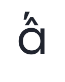
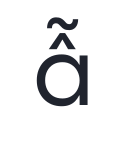

# List of Character Variants of Cal Sans

Generated from `fonts/calsans-var-full/CalSansVF.ttf` — Version 2.000; fcf0594.

Every glyph the set **produces**. Rows wrap every 10; `↳` marks a continuation.
Light and dark are selected by `<picture>`.

## `cv01` — Geometric a

71 substitutions produce **24 distinct forms**.

<table>
<tr><td rowspan="2" align="left"><code><b>cv01</b></code> Geometric a 24 forms</td><td align="center"><picture><source media="(prefers-color-scheme: dark)" srcset="variants2/g/a-ss01.dark.svg"></picture></td><td align="center"><picture><source media="(prefers-color-scheme: dark)" srcset="variants2/g/aacute-ss01.dark.svg"></picture></td><td align="center"><picture><source media="(prefers-color-scheme: dark)" srcset="variants2/g/abreve-ss01.dark.svg"></picture></td><td align="center"><picture><source media="(prefers-color-scheme: dark)" srcset="variants2/g/acircumflex-ss01.dark.svg"></picture></td><td align="center"><picture><source media="(prefers-color-scheme: dark)" srcset="variants2/g/adieresis-ss01.dark.svg"></picture></td><td align="center"><picture><source media="(prefers-color-scheme: dark)" srcset="variants2/g/agrave-ss01.dark.svg"></picture></td><td align="center"><picture><source media="(prefers-color-scheme: dark)" srcset="variants2/g/amacron-ss01.dark.svg"></picture></td><td align="center"><picture><source media="(prefers-color-scheme: dark)" srcset="variants2/g/aogonek-ss01.dark.svg"></picture></td><td align="center"><picture><source media="(prefers-color-scheme: dark)" srcset="variants2/g/aring-ss01.dark.svg"></picture></td><td align="center"><picture><source media="(prefers-color-scheme: dark)" srcset="variants2/g/atilde-ss01.dark.svg"></picture></td></tr><tr><td align="center"><code>a.ss01</code></td><td align="center"><code>aacute.ss01</code></td><td align="center"><code>abreve.ss01</code></td><td align="center"><code>acircumflex.ss01</code></td><td align="center"><code>adieresis.ss01</code></td><td align="center"><code>agrave.ss01</code></td><td align="center"><code>amacron.ss01</code></td><td align="center"><code>aogonek.ss01</code></td><td align="center"><code>aring.ss01</code></td><td align="center"><code>atilde.ss01</code></td></tr>
<tr><td rowspan="2" align="center">&#8627;</td><td align="center"><picture><source media="(prefers-color-scheme: dark)" srcset="variants2/g/ordfeminine-ss01.dark.svg"></picture></td><td align="center"><picture><source media="(prefers-color-scheme: dark)" srcset="variants2/g/uni0203-ss01.dark.svg"></picture></td><td align="center"><picture><source media="(prefers-color-scheme: dark)" srcset="variants2/g/uni1EA1-ss01.dark.svg"></picture></td><td align="center"><picture><source media="(prefers-color-scheme: dark)" srcset="variants2/g/uni1EA3-ss01.dark.svg"></picture></td><td align="center"><picture><source media="(prefers-color-scheme: dark)" srcset="variants2/g/uni1EA5-ss01.dark.svg"></picture></td><td align="center"><picture><source media="(prefers-color-scheme: dark)" srcset="variants2/g/uni1EA7-ss01.dark.svg"></picture></td><td align="center"><picture><source media="(prefers-color-scheme: dark)" srcset="variants2/g/uni1EA9-ss01.dark.svg"></picture></td><td align="center"><picture><source media="(prefers-color-scheme: dark)" srcset="variants2/g/uni1EAB-ss01.dark.svg"></picture></td><td align="center"><picture><source media="(prefers-color-scheme: dark)" srcset="variants2/g/uni1EAD-ss01.dark.svg"></picture></td><td align="center"><picture><source media="(prefers-color-scheme: dark)" srcset="variants2/g/uni1EAF-ss01.dark.svg"></picture></td></tr><tr><td align="center"><code>ordfeminine.ss01</code></td><td align="center"><code>uni0203.ss01</code></td><td align="center"><code>uni1EA1.ss01</code></td><td align="center"><code>uni1EA3.ss01</code></td><td align="center"><code>uni1EA5.ss01</code></td><td align="center"><code>uni1EA7.ss01</code></td><td align="center"><code>uni1EA9.ss01</code></td><td align="center"><code>uni1EAB.ss01</code></td><td align="center"><code>uni1EAD.ss01</code></td><td align="center"><code>uni1EAF.ss01</code></td></tr>
<tr><td rowspan="2" align="center">&#8627;</td><td align="center"><picture><source media="(prefers-color-scheme: dark)" srcset="variants2/g/uni1EB1-ss01.dark.svg"></picture></td><td align="center"><picture><source media="(prefers-color-scheme: dark)" srcset="variants2/g/uni1EB3-ss01.dark.svg"></picture></td><td align="center"><picture><source media="(prefers-color-scheme: dark)" srcset="variants2/g/uni1EB5-ss01.dark.svg"></picture></td><td align="center"><picture><source media="(prefers-color-scheme: dark)" srcset="variants2/g/uni1EB7-ss01.dark.svg"></picture></td></tr><tr><td align="center"><code>uni1EB1.ss01</code></td><td align="center"><code>uni1EB3.ss01</code></td><td align="center"><code>uni1EB5.ss01</code></td><td align="center"><code>uni1EB7.ss01</code></td></tr>
</table>

## `ss01` — Geometric a

52 substitutions produce **26 distinct forms**.

<table>
<tr><td rowspan="2" align="left"><code><b>ss01</b></code> Geometric a 26 forms</td><td align="center"><picture><source media="(prefers-color-scheme: dark)" srcset="variants2/g/a-ss01.dark.svg"></picture></td><td align="center"><picture><source media="(prefers-color-scheme: dark)" srcset="variants2/g/aacute-ss01.dark.svg"></picture></td><td align="center"><picture><source media="(prefers-color-scheme: dark)" srcset="variants2/g/abreve-ss01.dark.svg"></picture></td><td align="center"><picture><source media="(prefers-color-scheme: dark)" srcset="variants2/g/acircumflex-ss01.dark.svg"></picture></td><td align="center"><picture><source media="(prefers-color-scheme: dark)" srcset="variants2/g/adieresis-ss01.dark.svg"></picture></td><td align="center"><picture><source media="(prefers-color-scheme: dark)" srcset="variants2/g/ae-ss01.dark.svg"></picture></td><td align="center"><picture><source media="(prefers-color-scheme: dark)" srcset="variants2/g/agrave-ss01.dark.svg"></picture></td><td align="center"><picture><source media="(prefers-color-scheme: dark)" srcset="variants2/g/amacron-ss01.dark.svg"></picture></td><td align="center"><picture><source media="(prefers-color-scheme: dark)" srcset="variants2/g/aogonek-ss01.dark.svg"></picture></td><td align="center"><picture><source media="(prefers-color-scheme: dark)" srcset="variants2/g/aring-ss01.dark.svg"></picture></td></tr><tr><td align="center"><code>a.ss01</code></td><td align="center"><code>aacute.ss01</code></td><td align="center"><code>abreve.ss01</code></td><td align="center"><code>acircumflex.ss01</code></td><td align="center"><code>adieresis.ss01</code></td><td align="center"><code>ae.ss01</code></td><td align="center"><code>agrave.ss01</code></td><td align="center"><code>amacron.ss01</code></td><td align="center"><code>aogonek.ss01</code></td><td align="center"><code>aring.ss01</code></td></tr>
<tr><td rowspan="2" align="center">&#8627;</td><td align="center"><picture><source media="(prefers-color-scheme: dark)" srcset="variants2/g/atilde-ss01.dark.svg"></picture></td><td align="center"><picture><source media="(prefers-color-scheme: dark)" srcset="variants2/g/ordfeminine-ss01.dark.svg"></picture></td><td align="center"><picture><source media="(prefers-color-scheme: dark)" srcset="variants2/g/uni01E3-ss01.dark.svg"></picture></td><td align="center"><picture><source media="(prefers-color-scheme: dark)" srcset="variants2/g/uni0203-ss01.dark.svg"></picture></td><td align="center"><picture><source media="(prefers-color-scheme: dark)" srcset="variants2/g/uni1EA1-ss01.dark.svg"></picture></td><td align="center"><picture><source media="(prefers-color-scheme: dark)" srcset="variants2/g/uni1EA3-ss01.dark.svg"></picture></td><td align="center"><picture><source media="(prefers-color-scheme: dark)" srcset="variants2/g/uni1EA5-ss01.dark.svg"></picture></td><td align="center"><picture><source media="(prefers-color-scheme: dark)" srcset="variants2/g/uni1EA7-ss01.dark.svg"></picture></td><td align="center"><picture><source media="(prefers-color-scheme: dark)" srcset="variants2/g/uni1EA9-ss01.dark.svg"></picture></td><td align="center"><picture><source media="(prefers-color-scheme: dark)" srcset="variants2/g/uni1EAB-ss01.dark.svg"></picture></td></tr><tr><td align="center"><code>atilde.ss01</code></td><td align="center"><code>ordfeminine.ss01</code></td><td align="center"><code>uni01E3.ss01</code></td><td align="center"><code>uni0203.ss01</code></td><td align="center"><code>uni1EA1.ss01</code></td><td align="center"><code>uni1EA3.ss01</code></td><td align="center"><code>uni1EA5.ss01</code></td><td align="center"><code>uni1EA7.ss01</code></td><td align="center"><code>uni1EA9.ss01</code></td><td align="center"><code>uni1EAB.ss01</code></td></tr>
<tr><td rowspan="2" align="center">&#8627;</td><td align="center"><picture><source media="(prefers-color-scheme: dark)" srcset="variants2/g/uni1EAD-ss01.dark.svg"></picture></td><td align="center"><picture><source media="(prefers-color-scheme: dark)" srcset="variants2/g/uni1EAF-ss01.dark.svg"></picture></td><td align="center"><picture><source media="(prefers-color-scheme: dark)" srcset="variants2/g/uni1EB1-ss01.dark.svg"></picture></td><td align="center"><picture><source media="(prefers-color-scheme: dark)" srcset="variants2/g/uni1EB3-ss01.dark.svg"></picture></td><td align="center"><picture><source media="(prefers-color-scheme: dark)" srcset="variants2/g/uni1EB5-ss01.dark.svg"></picture></td><td align="center"><picture><source media="(prefers-color-scheme: dark)" srcset="variants2/g/uni1EB7-ss01.dark.svg"></picture></td></tr><tr><td align="center"><code>uni1EAD.ss01</code></td><td align="center"><code>uni1EAF.ss01</code></td><td align="center"><code>uni1EB1.ss01</code></td><td align="center"><code>uni1EB3.ss01</code></td><td align="center"><code>uni1EB5.ss01</code></td><td align="center"><code>uni1EB7.ss01</code></td></tr>
</table>
